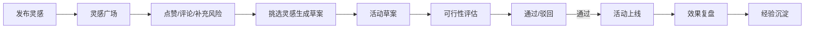

## 1. 产品概述

游戏运营灵感管理平台，帮助游戏运营团队高效策划节日活动、礼包和任务玩法。通过灵感广场、素材库、活动草案、可行性评估和复盘五大模块，实现从创意收集到效果复盘的全流程管理。

- 核心用户：游戏运营团队成员（活动策划、运营经理、数据分析师）
- 核心价值：提升活动策划效率，沉淀团队创意资产，数据驱动活动优化

## 2. 核心功能

### 2.1 用户角色

| 角色 | 核心权限 |
|------|----------|
| 运营团队成员 | 发布灵感、上传素材、评论点赞、创建草案、填写复盘 |
| 运营负责人 | 以上全部 + 可行性评估、指派负责人 |

### 2.2 功能模块

1. **灵感广场**：展示所有灵感点子，支持筛选、点赞、评论、补充风险
2. **素材库**：管理海报草图、竞品截图等参考素材
3. **活动草案**：挑选灵感生成活动方案，列出资源需求、验证指标、负责人
4. **可行性评估**：对活动草案进行风险评估和资源评估
5. **复盘页**：活动结束后登记效果数据和经验总结

### 2.3 页面详情

| 页面名称 | 模块名称 | 功能描述 |
|----------|----------|----------|
| 灵感广场 | 灵感卡片列表 | 瀑布流展示灵感卡片，显示标题、标签、点赞数、评论数 |
| 灵感广场 | 筛选标签栏 | 按节日、付费、留存等标签筛选灵感 |
| 灵感广场 | 发布灵感弹窗 | 填写玩法点子、目标玩家、奖励形式、上线窗口、参考活动 |
| 灵感广场 | 灵感详情抽屉 | 查看详情、点赞、评论、补充风险点 |
| 素材库 | 素材网格 | 展示海报草图、竞品截图等素材 |
| 素材库 | 上传素材 | 支持图片上传和标签分类 |
| 活动草案 | 草案列表 | 展示所有活动草案，显示状态、负责人、时间线 |
| 活动草案 | 草案详情 | 资源需求、验证指标、关联灵感、时间计划 |
| 可行性评估 | 评估列表 | 待评估和已评估的活动列表 |
| 可行性评估 | 评估表单 | 风险评估、资源评估、收益预估、决策建议 |
| 复盘页 | 复盘列表 | 已结束活动的复盘记录 |
| 复盘页 | 复盘详情 | 效果数据、经验总结、优化建议 |

## 3. 核心流程

核心流程说明：运营人员在灵感广场记录创意点子，团队成员可点赞、评论和补充风险。优质灵感可被挑选生成活动草案，明确资源需求、验证指标和负责人。草案经过可行性评估后进入上线阶段，活动结束后进行效果复盘，沉淀经验。

## 4. 用户界面设计

### 4.1 设计风格

- **主色调**：深靛蓝 (#1e1b4b) + 霓虹紫 (#7c3aed) + 荧光青 (#22d3ee)
- **辅助色**：琥珀橙 (#f59e0b)、玫红 (#ec4899)、翠绿 (#10b981)
- **背景**：深色模式，深靛蓝渐变底色，搭配微妙网格纹理
- **按钮风格**：圆润胶囊形，渐变填充，hover 时有发光效果
- **字体**：展示字体使用 Orbitron（科技感），正文使用 Inter（清晰易读）
- **布局风格**：卡片式布局，毛玻璃效果，层次分明
- **图标风格**：Lucide 线性图标，统一描边宽度

### 4.2 页面设计概览

| 页面名称 | 模块名称 | UI 元素 |
|----------|----------|---------|
| 灵感广场 | 顶部导航 | 品牌 Logo、页面切换标签、用户头像 |
| 灵感广场 | 筛选栏 | 标签胶囊、搜索框、排序下拉 |
| 灵感广场 | 灵感卡片 | 渐变边框、标签徽章、点赞/评论计数、悬停浮起动画 |
| 灵感广场 | 发布按钮 | 悬浮右下角、渐变发光、点击展开弹窗 |
| 素材库 | 素材网格 | 等宽网格、图片卡片、悬停放大效果 |
| 活动草案 | 时间线 | 垂直时间线、状态节点、进度指示 |
| 可行性评估 | 评估面板 | 评分仪表盘、风险标签、决策按钮 |
| 复盘页 | 数据卡片 | 指标数值、环比箭头、趋势小图 |

### 4.3 响应式设计

- 桌面端优先设计（1440px 基准）
- 平板端：卡片列数减少，侧边栏收起
- 移动端：单栏布局，底部导航栏，弹窗改为全屏

### 4.4 动效设计

- 页面加载：元素渐入 + 轻微上移，错开时间
- 卡片悬停：向上浮起 + 阴影加深 + 边框发光
- 按钮点击：缩放反馈 + 波纹扩散
- 弹窗出现：缩放 + 模糊背景
- 标签切换：内容淡入淡出 + 滑动指示器
