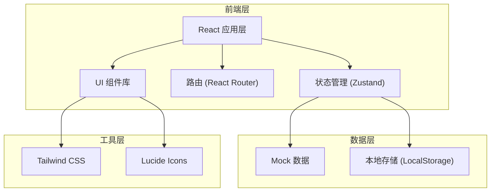
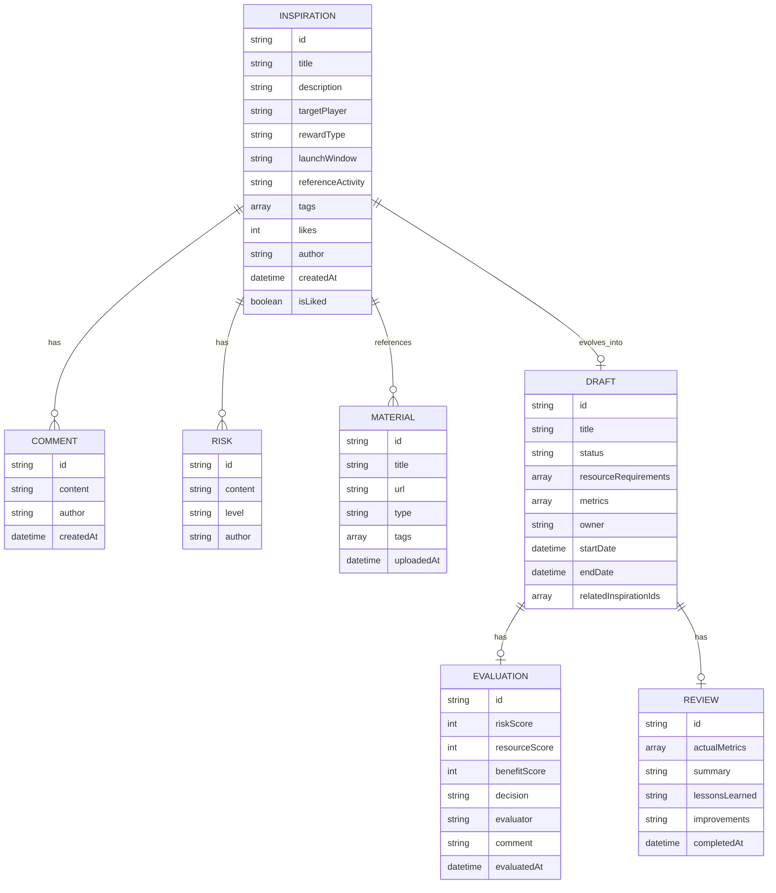

## 1. 架构设计



## 2. 技术栈描述

- **前端框架**：React 18 + TypeScript
- **构建工具**：Vite 5
- **样式方案**：Tailwind CSS 3
- **状态管理**：Zustand
- **路由管理**：React Router v6
- **图标库**：Lucide React
- **数据持久化**：LocalStorage + Mock 数据
- **初始化工具**：vite-init

## 3. 路由定义

| 路由路径 | 页面名称 | 说明 |
|----------|----------|------|
| / | 灵感广场 | 首页，展示所有灵感点子 |
| /materials | 素材库 | 管理海报草图和竞品截图 |
| /drafts | 活动草案 | 活动方案列表和详情 |
| /evaluation | 可行性评估 | 活动评估和决策 |
| /review | 复盘页 | 活动效果复盘 |

## 4. 数据模型

### 4.1 数据模型定义



### 4.2 核心数据类型定义

```typescript
// 灵感
interface Inspiration {
  id: string;
  title: string;
  description: string;
  targetPlayer: string;
  rewardType: string;
  launchWindow: string;
  referenceActivity: string;
  tags: string[];
  likes: number;
  author: string;
  createdAt: string;
  isLiked: boolean;
  comments: Comment[];
  risks: Risk[];
}

// 评论
interface Comment {
  id: string;
  content: string;
  author: string;
  createdAt: string;
}

// 风险点
interface Risk {
  id: string;
  content: string;
  level: 'low' | 'medium' | 'high';
  author: string;
}

// 素材
interface Material {
  id: string;
  title: string;
  url: string;
  type: 'poster' | 'competitor' | 'sketch' | 'other';
  tags: string[];
  uploadedAt: string;
}

// 活动草案
interface Draft {
  id: string;
  title: string;
  status: 'draft' | 'pending' | 'approved' | 'rejected' | 'running' | 'completed';
  resourceRequirements: ResourceRequirement[];
  metrics: Metric[];
  owner: string;
  startDate: string;
  endDate: string;
  relatedInspirationIds: string[];
}

// 资源需求
interface ResourceRequirement {
  id: string;
  type: string;
  description: string;
  quantity: number;
}

// 验证指标
interface Metric {
  id: string;
  name: string;
  target: number;
  unit: string;
}

// 可行性评估
interface Evaluation {
  id: string;
  draftId: string;
  riskScore: number;
  resourceScore: number;
  benefitScore: number;
  decision: 'approved' | 'rejected' | 'pending';
  evaluator: string;
  comment: string;
  evaluatedAt: string;
}

// 复盘
interface Review {
  id: string;
  draftId: string;
  actualMetrics: ActualMetric[];
  summary: string;
  lessonsLearned: string;
  improvements: string;
  completedAt: string;
}

// 实际指标
interface ActualMetric {
  id: string;
  name: string;
  actual: number;
  target: number;
  unit: string;
}
```

## 5. 项目结构

```
src/
├── components/          # 通用组件
│   ├── Layout/          # 布局组件
│   ├── Card/            # 卡片组件
│   ├── Modal/           # 弹窗组件
│   ├── Tag/             # 标签组件
│   └── Button/          # 按钮组件
├── pages/               # 页面组件
│   ├── Inspiration/     # 灵感广场
│   ├── Materials/       # 素材库
│   ├── Drafts/          # 活动草案
│   ├── Evaluation/      # 可行性评估
│   └── Review/          # 复盘页
├── store/               # 状态管理
│   └── useAppStore.ts
├── data/                # Mock 数据
│   └── mockData.ts
├── types/               # TypeScript 类型
│   └── index.ts
├── utils/               # 工具函数
│   └── helpers.ts
├── App.tsx              # 应用入口
├── main.tsx             # 渲染入口
└── index.css            # 全局样式
```

## 6. 状态管理设计

使用 Zustand 管理全局状态，包含：

- `inspirations`: 灵感列表
- `materials`: 素材列表
- `drafts`: 活动草案列表
- `evaluations`: 评估记录列表
- `reviews`: 复盘记录列表
- `currentUser`: 当前用户

主要 actions：
- 增删改查灵感/素材/草案/评估/复盘
- 点赞/取消点赞灵感
- 添加评论和风险点
- 从灵感生成活动草案
- 提交评估和复盘
